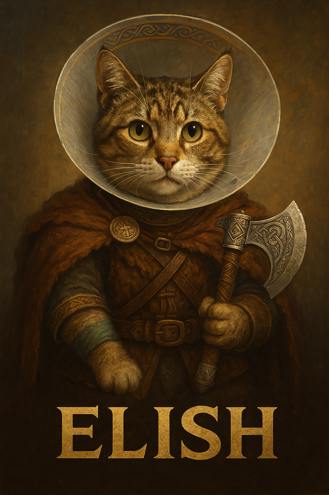

# 🛡️ Elish the Watchcat: GitHub Action to Track Humane Society Listings

> “She may have been wounded, but she is still fierce.”  
> – In loving memory and hope for reunion.

This GitHub project automatically checks the [Calgary Humane Society Cat Listings](https://www.calgaryhumane.ca/adopt/cats/) multiple times a day for key terms that may help us reunite with a beloved cat named **Elish**.

### 🔍 What It Does
This automation:
- Scrapes the adoption page for updates.
- Searches for keywords like:
  - `elish`
  - `broken leg`
  - `surrendered`
  - `recovering`
- Logs matches to a file.
- Runs at **9:05am**, **11:00am**, **2:00pm**, **4:00pm**, and **6:00pm** (Calgary time).

### 🧰 Technologies Used
- Python (requests + BeautifulSoup)
- GitHub Actions (Cron jobs)
- Markdown logging

### 🚀 How to Use
1. Clone this repo.
2. Customize keywords in `check_cat_listings.py` if needed.
3. Push to GitHub and enable Actions.
4. Watch for new entries in `cat_matches_log.txt`.

### ❤️ Tribute
This project is dedicated to **Elish**, the brave feline warrior whose spirit lives on.  
*May we find her again.*

---

🔗 **Epic Artwork Source**:  
[Your Image URL or Upload Path Goes Here]

---

### 📜 License
MIT – Free to use, modify, and share.

